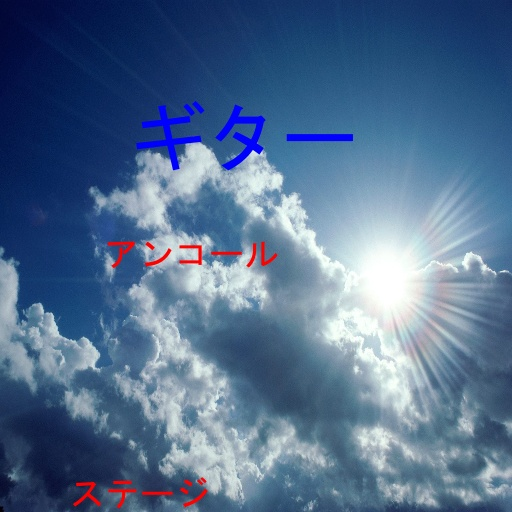
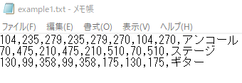
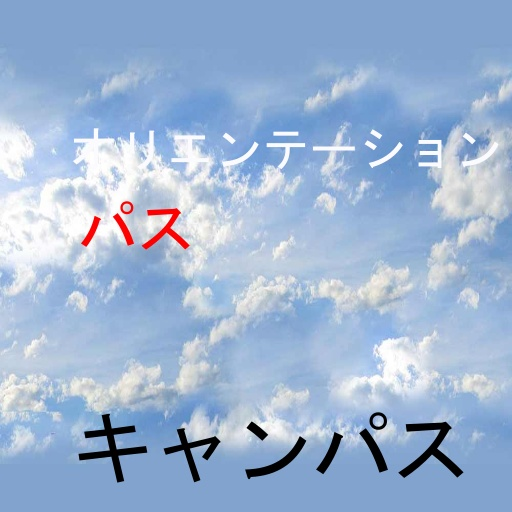
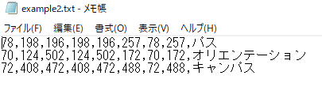
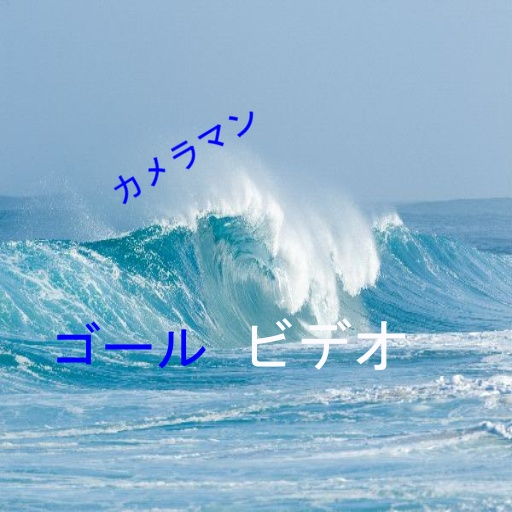
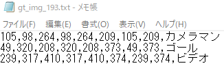
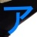
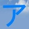

# JapaneseTextDetectionRecognitionDatasetsGenerator

System that creates images for Japanese scene text detection and recognition projects.

## Examples

### Datasets for detection task









### Dataset for recognition task





## Usage

If you wannt download background images by using bing-image-downloader, run

```python
icrawler.py
```

You can add search query in array 'query = ["sky", "ocean"]'

It downloads images from bing and saves them in images dir.
Then run

```python
put_text.py
```

Output will be in resuls/images dir, scene images with katakana text and text file representing bounding box and Japanese katakana text.
In config file, you can change settings, for example, angle of text and font scale.

```python
gen_char_image.py
```

generates images of katakana characters.

And

```python
split_dataset.py
```

splits images in results/images for train and val.

## Requirements

```python
bing-image-downloader
numpy
pillow
opencv-python
matplotlib
scipy
split-folders
```

You also need to create fonts dir and put your font in it. Then change font name in config file.

## Description

To collect background images, I used the Python library bing-images-downloader, which lets you downloads tons of images directly from Bing Image Search.
All collected images from Bing.com are preprocessed into the shape of 512x512. Then one to three words will be attached per photo. This value is random, and words are picked from the prepared 466 terms list. In the process of image generation, the following values are randomly determined.

- Font scale is between 30 to 80.
- Text will be rotated in one-in-three chance.
- Rotated angle is between -30 to 30 degrees.
- Text color will be picked from white, black, red, brown, blue, and light blue, but the chance of white and black will be about twice as high as for other colors.

You can change those value in config file.

The text files are comma-separated files, where each line will correspond to one word in the image and gives its bounding box coordinates and its transcription in the format: top left x, top left y, top right x, top right y, bottom right x, bottom right y, bottom left x, bottom left y, transcription.

Images of katakana characters are also created. These were obtained by using the images and text files that have been created put_text file. Images size is 48x48x3 (RGB).

If you want to generate images with English, edit katakana_words text file and uncomment line 60-64 in put_text

## References

The text is extracted from [便利手帳コム](http://benritecho.com/katakanakotoba.html) contains 466 Japanese words written in only katakana.
